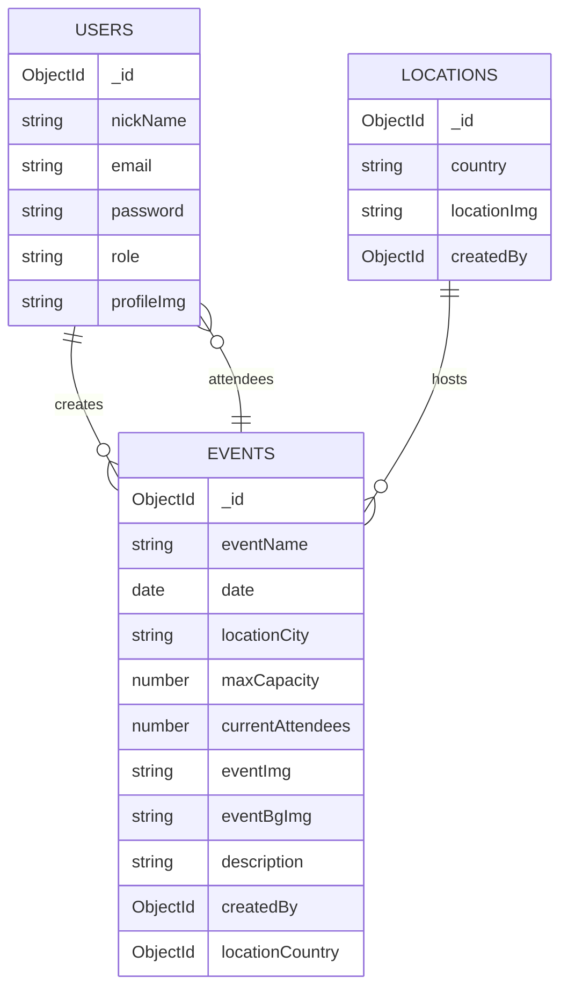

# EventHub API

API REST construida con **Node.js**, **Express**, **MongoDB (Mongoose)**
y **Cloudinary** para gestionar **usuarios, eventos y localizaciones**.\
Permite creación, lectura, actualización y eliminación de datos, manejo
de imágenes mediante Cloudinary, sistema de **autenticación con JWT** y
autorización por **roles** (`user`, `admin`).

---

## Instalación y uso

1.  Clona el repositorio:

```bash
git clone https://github.com/AleixSu/Project10.Full_Stack_JS.git
```

2.  Entra al directorio:

```bash
cd <repo>
```

3.  Instala dependencias:

```bash
npm install
```

4.  Crea archivo `.env`:

```env
DB_URL=mongodb+srv://<USER>:<PASSWORD>@cluster.mongodb.net/eventhubDB
JWT_SECRET=supersecret
CLOUD_NAME=<cloudinary_name>
API_KEY=<cloudinary_key>
API_SECRET=<cloudinary_secret>
PORT=3000
```

5.  Inicia servidor:

```bash
npm run dev
```

Base URL:\
`http://localhost:3000/api/v1`

---

## Endpoints disponibles

## Users

Base: `/api/v1/users`

---

Método Endpoint Descripción Acceso

---

POST `/login` Inicia sesión y devuelve token JWT. Libre

POST `/register` Registra usuario con imagen opcional. Libre

GET `/profile` Devuelve datos del usuario autenticado Autenticado
(populate avanzado).

GET `/` Obtiene todos los usuarios. Libre

GET `/:id` Obtiene usuario por ID. Libre

PATCH `/:id` Actualiza usuario (propietario o admin). Propietario,
admin

DELETE `/:id` Elimina usuario (propietario o admin). Propietario,
admin

---

### Ejemplo de body para registro

```json
{
  "nickName": "aleix",
  "email": "test@test.com",
  "password": "Aa123456!",
  "location": "Barcelona"
}
```

---

## Events

Base: `/api/v1/events`

---

Método Endpoint Descripción Acceso

---

GET `/` Obtiene todos los eventos (populate Libre
completo).

GET `/location/:ids` Obtiene eventos filtrados por países. Libre

GET `/:id` Obtiene evento por ID. Libre

POST `/` Crea evento con imágenes (eventImg, Admin
eventBgImg).

PATCH `/:id` Actualiza evento con imágenes opcionales. Admin

PATCH `/:id/sign_up` Inscripción del usuario autenticado en el Autenticado
evento.

PATCH `/:id/unsign_up` Cancelación de asistencia del usuario. Autenticado

DELETE `/:id` Elimina evento. Admin

---

### Ejemplo de body para POST

```json
{
  "eventName": "Tech Meetup",
  "date": "2025-01-20",
  "locationCountry": "ObjectId('...')",
  "locationCity": "Berlin",
  "maxCapacity": 50,
  "description": "Networking y charlas"
}
```

---

## Locations

Base: `/api/v1/locations`

---

Método Endpoint Descripción Acceso

---

GET `/` Devuelve todas las localizaciones. Libre

GET `/countries` Lista países con su ID. Libre

GET `/:id` Obtiene una localización por ID. Libre

POST `/` Crea localización con imagen. Admin

PATCH `/:id` Actualiza localización. Admin

DELETE `/:id` Elimina localización. Admin

---

### Ejemplo body para POST

```json
{
  "country": "Spain"
}
```

---

## Roles y autenticación

- **user** → operaciones sobre su propio perfil, asistir o cancelar
  asistencia a eventos.\
- **admin** → controla CRUD completo de eventos y localizaciones,
  puede editar y eliminar usuarios.

Los tokens JWT se envían mediante header:

    Authorization: Bearer <token>

---

## Tecnologías usadas

- Node.js + Express\
- MongoDB + Mongoose\
- Cloudinary + multer-storage-cloudinary\
- bcrypt\
- jsonwebtoken\
- dotenv\
- nodemon

---

## Relaciones entre colecciones



---

## Manejo de imágenes

Imágenes cargadas a Cloudinary mediante `multer-storage-cloudinary`.\
Borrado mediante utilidad personalizada que obtiene `public_id` desde la
URL y ejecuta:

```js
cloudinary.uploader.destroy(public_id)
```

---

## Manejo de errores

Middleware centralizado que identifica errores de validación de Mongoose
y retorna mensajes claros.\
Para otros casos, responde código y mensaje genérico.

---

## Rutas no especificadas

```js
app.use((req, res) => {
  res.status(404).json({ error: 'Route not found' })
})
```

---

## Recomendaciones para testeo

1.  Registra un usuario normal y un admin mediante seed o DB.\
2.  Usa el token del admin para crear localizaciones y eventos.\
3.  Usa cuenta de usuario para inscribirte o cancelar asistencia.\
4.  Verifica eliminación de imágenes en Cloudinary al borrar entidades.
